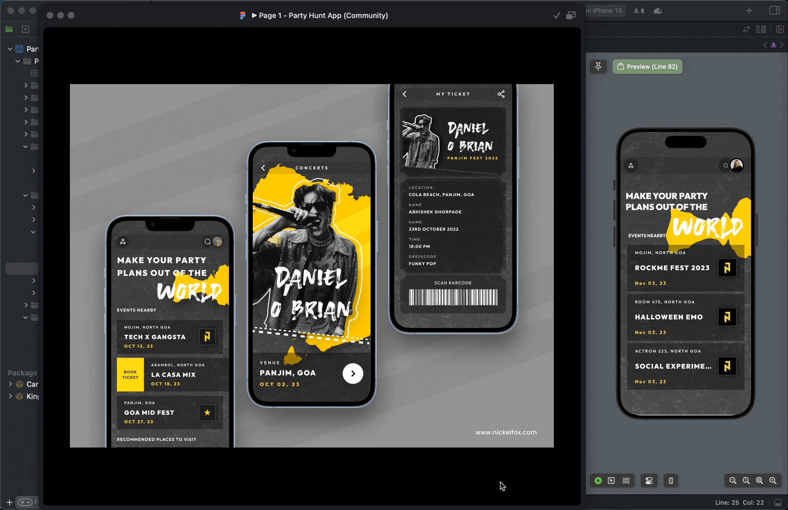

# Party Hunt - Clean Architecture / SwiftUI17 👋

App using figma design, get data from JSON file [Party Hunt App](https://www.figma.com/file/6kp9ovDTJKRJsc0aDcd1Uc/Party-Hunt-App-(Community)?node-id=1%3A8&mode=dev))

 
  
     Figma desing connected with API Rapid
      
  
  
  
   
     
    <a href="https://github.com/brsaca/PartyHunt/issues/new">Report bug</a>
    ·
    <a href="https://github.com/brsaca/PartyHunt/issues/new">Request feature</a>

## 👤 Author

**Brenda Saavedra**

- WebPage: [brendasaavedra.com](http://brendasaavedra.com)
- Github: [@brsaca](https://github.com/brsaca/)
